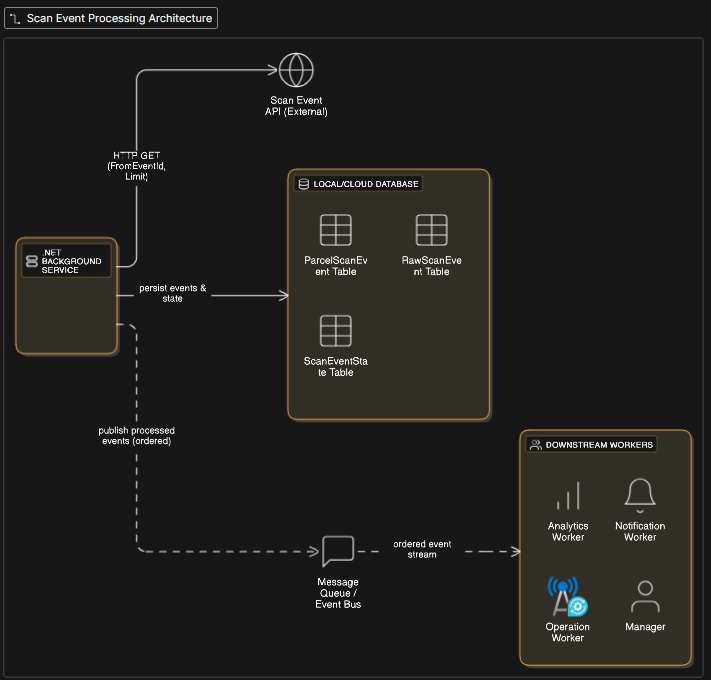

# ParcelScanTrackerDev

## Overview
ParcelScanTrackerDev is a .NET 9 worker service that continuously polls a Scan Event API to track the latest status of parcels and record pickup/delivery milestones.  
It is designed for resilience, fault tolerance, and smooth integration with downstream systems such as dashboards, analytics, and customer APIs.

**Key features:**
- Polls the Scan Event API at configurable intervals
- Stores raw scan events for audit and diagnostics
- Maintains a latest-status view for each parcel
- Tracks first pickup and delivery timestamps
- Resumes from the last processed event after restarts
- Includes query and memory usage optimisations for large datasets

---

## 1. Environment Setup and Configuration


### 1.1 Prerequisites
- **.NET 9 SDK**
- **Git**
- **Microsoft SQL Server** & **SQL Server Management Studio (SSMS)**
- *(Optional)* **Visual Studio 2022** or **Visual Studio Code**

---

## 2. Configuration
Update `appsettings.json` with:
- **API base URL** (default: `http://localhost`)
- **Database connection string** (SQL Server)
- **Polling interval** and **batch size** for API calls

Ensure the Scan Event API supports:
```
GET /v1/scans/scanevents?FromEventId=<id>&Limit=<n>
```

**Sample `appsettings.json`**
```json
{
  "ConnectionStrings": {
    "DefaultConnection": "Server=localhost\\SQLEXPRESS;Database=ParcelScanDb;User Id=[UserId];Password={EncryptedPassword};TrustServerCertificate=True;"
  },
  "Encrypted": "xxxxxx",
  "ScanEventApi": {
    "BaseUrl": "http://localhost/v1/scans/scanevents",
    "Limit": 2,
    "PollingDelayMs": 10000
  },
  "Config": {
    "WorkerId": "W_AKL"
  }
}
```

---

## 3. Database Initialization
Run the following SQL scripts in SSMS to create database tables and indexes:

**1) Checkpoint / State (no dependencies)**
```sql
CREATE TABLE dbo.ScanEventState (
    Id            INT IDENTITY(1,1) PRIMARY KEY,
    LastEventId   INT       NOT NULL,
    WorkerId      NVARCHAR(30) NOT NULL UNIQUE
);
```

**2) Parcel Scan Event (UNIQUE business key on EventId)**
```sql
CREATE TABLE dbo.ParcelScanEvent (
    Id                   INT IDENTITY(1,1) NOT NULL CONSTRAINT PK_ParcelScanEvent PRIMARY KEY,
    EventId              INT       NOT NULL,
    ParcelId             INT       NOT NULL,
    [Type]               NVARCHAR(50) NOT NULL,
    CreatedDateTimeUtc   DATETIME2 NOT NULL CONSTRAINT DF_ParcelScanEvent_Created DEFAULT SYSUTCDATETIME(),
    StatusCode           NVARCHAR(50) NULL,
    RunId                NVARCHAR(50) NULL,
    WorkerId             NVARCHAR(30) NOT NULL,
    CONSTRAINT UQ_ParcelScanEvent_EventId UNIQUE (EventId)
);
CREATE INDEX IX_ParcelScanEvent_ParcelId ON dbo.ParcelScanEvent (ParcelId);
CREATE INDEX IX_ParcelScanEvent_Type ON dbo.ParcelScanEvent (Type);
CREATE INDEX IX_ParcelScanEvent_Created ON dbo.ParcelScanEvent (CreatedDateTimeUtc);
CREATE INDEX IX_ParcelScanEvent_Worker ON dbo.ParcelScanEvent (WorkerId);
```

**3) Raw Scan Event (linked to EventId)**
```sql
CREATE TABLE dbo.RawScanEvent (
    Id             INT IDENTITY(1,1) NOT NULL PRIMARY KEY,
    EventId        INT       NOT NULL UNIQUE,
    WorkerId       NVARCHAR(30) NOT NULL,
    RawJson        NVARCHAR(MAX) NOT NULL,
    IngestedAtUtc  DATETIME2 NOT NULL CONSTRAINT DF_RawScanEvent_IngestedAtUtc DEFAULT SYSUTCDATETIME()
);
```

---

## 4. Build and Execution Steps


### 1. Clone the Repository

git clone https://github.com/yeyanaung/ParcelScanTracker.git
 cd ParcelScanTracker.Worker

### 2. Restore Dependencies
dotnet restore

### 3. Build the Project
dotnet build

### 5. Run the Worker Service
dotnet run


### 6. Verify Logs
- Check the logs to ensure the worker service is running and processing events as expected. Logs are configured in `log4net.config`.
- Ensure the API endpoint specified in `ScanEventApi:BaseUrl` is accessible.

```

---

## 5. Assumptions
- API returns unique `EventId` values in ascending order.
- At least `PICKUP` and `DELIVERY` event types exist; unknown types may occur.
- Pickup/Delivery timestamps are recorded for the first occurrence only.
- Malformed events are skipped but logged.
- API supports `FromEventId` (inclusive) and `Limit` parameters.
- Parallel processing is supported if the API can handle it.
- Database can be replaced with another RDBMS (e.g., Oracle or a cloud-hosted database) in production.
- Default `Limit` is 500; this can be customised for each worker application.
- Raw JSON responses are stored for troubleshooting and investigation.

---

## 6. High-Level Architecture
```

---

## 7. Improvements & Productionisation
- **Query & Memory Optimisation**: Monitor event read queries and memory usage; adjust API `Limit` for optimal worker performance.
- **Bottleneck Handling**: For API query delays, implement waiting queues or throttling to prevent overload.
- **Fault Isolation**: Isolate component failures to prevent cascading issues.
- **Infrastructure & Scalability**: Managed DB services (Azure SQL, AWS RDS), Docker/Kubernetes, load balancing.
- **Resilience**: Retry & circuit breaker patterns, DLQ(Dead-Letter Queue) for failed events, health checks.
- **Architecture**: Event sourcing & CQRS(Command Query Responsibility Segregation) for workflows, message queues for downstream consumers.
- **Performance**: Add indexes on required fields like ParcelId, Type, StatusCode; optimize queries.
- **Security**: JWT/client SSL authentication, secure credentials in vaults, encrypt sensitive data.
- **Monitoring**: Centralized logging, metrics, and alerting.
- **Extensibility**: Extend API for richer queries (parcel ID, status, SLA).
- **DevOps**: Automated tests, CI/CD pipelines, deployment scripts.

---

## 8. Security Considerations
- Store credentials securely (environment variables, key vaults)
- Encrypt sensitive data at rest
- Use HTTPS for all API communication
- Sanitize logs to prevent leakage of sensitive data
- Apply least privilege to DB accounts

---

## 9. Troubleshooting
| Issue | Possible Cause | Resolution |
|-------|----------------|------------|
| No events processed | API URL/config incorrect | Verify `appsettings.json` and API availability |
| Duplicate events | API returned duplicates | System ignores duplicates via PK constraints |
| Database not created | SQL script not run | Execute table creation scripts |
| API timeouts | Network/server issue | Increase timeout, enable retries |
